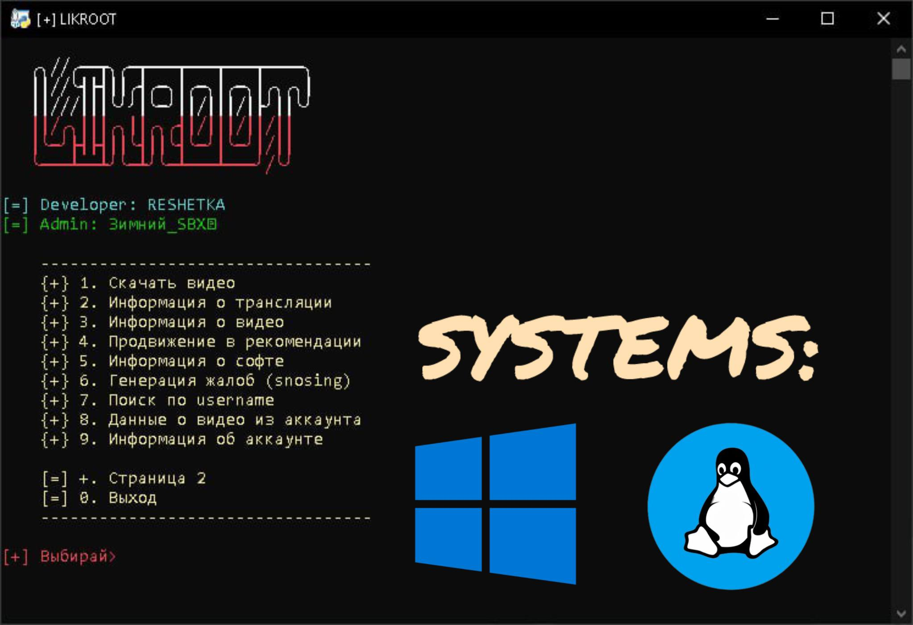

# LIKROOT

#### LIKROOT - это программное обеспечение, предназначенное для автоматизации и анализа данных в социальной сети Likee. Оно предоставляет пользователям расширенные возможности по взаимодействию с платформой, позволяя автоматизировать различные задачи.

## ▌Функциональные возможности:

#### •  Массовая отправка жалоб: Автоматизированная отправка жалоб на контент и пользователей.
#### •  Генерация жалоб: Генератор жалоб, направленных на удаление контента.
#### •  Скачивание видео без водяного знака: Загрузка видеороликов из Likee без фирменного знака платформы.
#### •  Получение информации о видео: Извлечение данных о конкретном видеоролике (количество просмотров, лайков, комментариев и т.д).
#### •  Получение информации о трансляции: Сбор данных о текущей трансляции (количество зрителей, информация о стримере).
#### •  Получение информации о видео из аккаунта (JSON): Экспорт информации о всех видео, размещенных в определенном аккаунте, в формате JSON.
#### •  Получение информации из аккаунта (JSON): Экспорт данных об аккаунте (количество подписчиков, информация о профиле) в формате JSON.
#### •  Функция создания Crash картинки для перегрузки чатов
#### •  Генератор сессий + чекер сессий

## ▌Установка

### Termux:
- pkg install python 
- pkg install git
- git clone https://github.com/Andrey16016/LIKROOT
- pip install colorama
- pip install requests

### ISH SHELL:
- apk add python3 
- apk add git
- git clone https://github.com/Andrey16016/LIKROOT
- apk add py3-pip
- pip install requests
- pip install colorama

### Запуск:
- cd LIKROOT
- python3 LIKROOT.py

## Лицензия
#### [License](https://raw.githubusercontent.com/Andrey16016/LIKROOT/main/LICENSE)

## ▌Контакты:

#### Telegram: https://t.me/+Q6dkr4rcjJEwY2Qy
#### RESHETKA в Likee: @FEDERAL_OSINT
